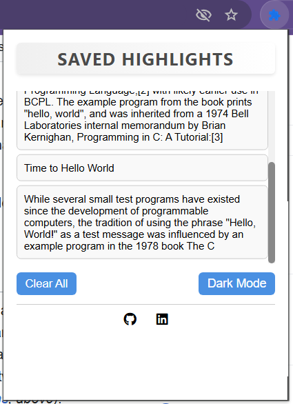
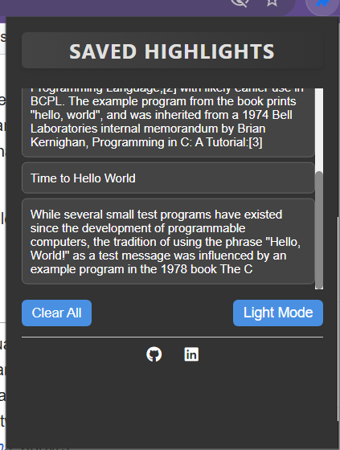

# Highlight Saver Chrome Extension

A simple and elegant Chrome extension that allows users to save highlighted text from webpages, view them in a popup, and toggle between light and dark themes.

## Features
- **Save Highlights**: Right-click on selected text and choose "Save Highlight" to store it.
- **View Highlights**: See all saved highlights in a scrollable list with a clean, bordered design.
- **Theme Toggle**: Switch between light and dark themes with a single click.
- **Persistent Storage**: Highlights and theme preferences are saved and persist across all browser sessions.
- **Social Links**: Links to the developer's GitHub and LinkedIn profiles.

## Screenshots

## Installation
1. Download or clone this repository to your local machine:

git clone https://github.com/alireza-baqeri/highlight-saver.git

2. Open Chrome and go to `chrome://extensions/`.
3. Enable "Developer mode" (top right).
4. Click "Load unpacked" and select the folder containing the extension files (`highlight saver`).
5. The extension should now appear in your Chrome toolbar.

## Usage
1. Navigate to any webpage and select some text.
2. Right-click and choose "Save Highlight" from the context menu.
3. Click the extension icon in the Chrome toolbar to open the popup.
4. View your saved highlights in a scrollable list.
5. Use the "Toggle Theme" button to switch between light and dark modes.
6. Click "Clear All" to remove all saved highlights.

## Technologies Used
- **HTML/CSS**: For the popup UI and styling.
- **JavaScript**: For the extension logic.
- **Chrome Storage API**: For persistent storage of highlights and theme settings.
- **Font Awesome**: For GitHub and LinkedIn icons.

## Contributing
Contributions are welcome! If you'd like to contribute:
1. Fork this repository.
2. Create a new branch (`git checkout -b feature/your-feature`).
3. Make your changes and commit them (`git commit -m "Add your feature"`).
4. Push to your branch (`git push origin feature/your-feature`).
5. Open a Pull Request.

## License
This project is licensed under the MIT License - see the [LICENSE](LICENSE) file for details.

## Author
Developed by Alireza Bagheri  
- GitHub: [alireza-baqeri](https://github.com/alireza-baqeri)  
- LinkedIn: [Alireza Bagheri](https://www.linkedin.com/in/alireza-bagheri-a585b0239/)

## Future Improvements
- Add the ability to delete individual highlights.
- Include the URL and timestamp of each highlight.
- Add export/import functionality for highlights.#
